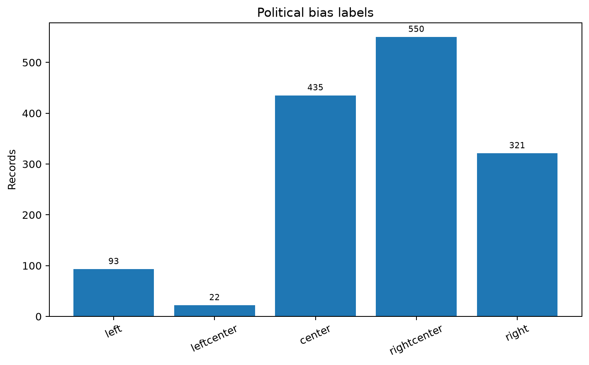
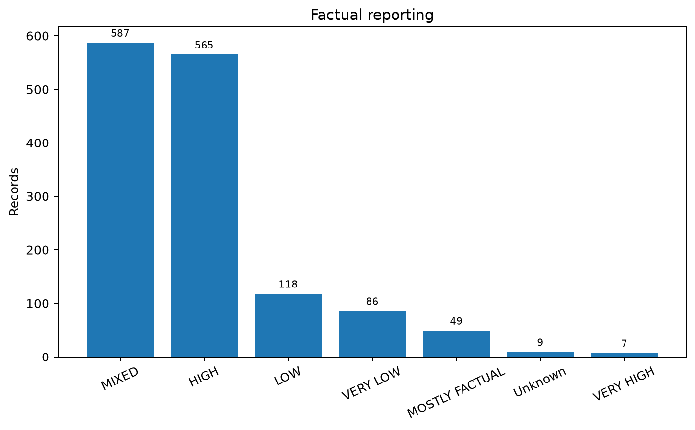
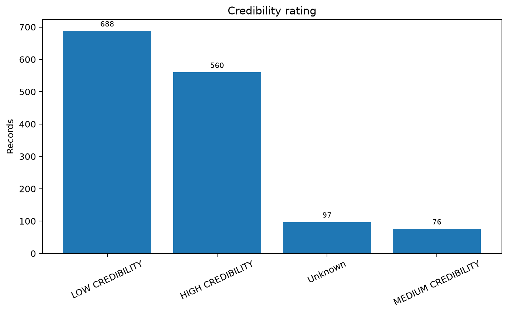
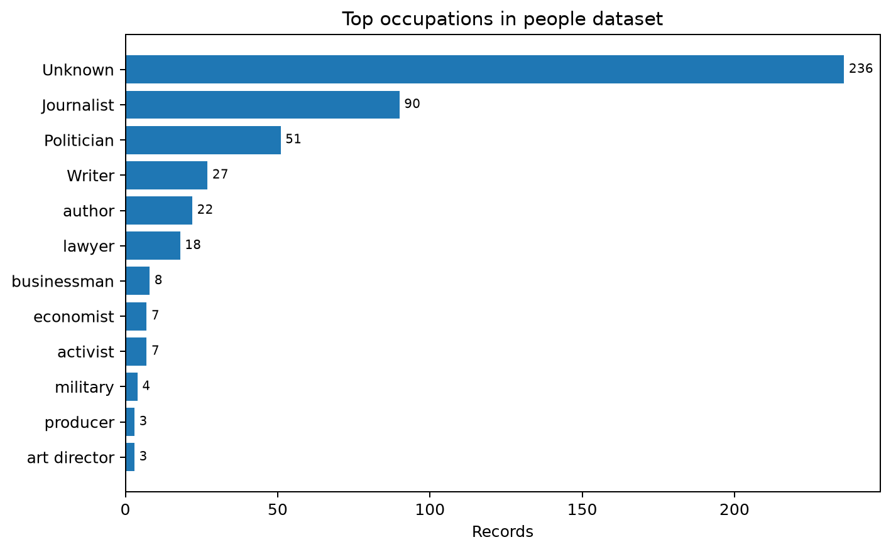

# Political Media Collection & Bias Analysis

Unified repository for collecting, enriching and analysing political-media sources, articles and related public figures.

The project combines several earlier scraping/analysis repositories into one pipeline covering media-source metadata, political-bias labels, AllSides article collection, Wikipedia enrichment and people/occupation data.

## Dataset snapshot

The current consolidated data contains:

- **1,421 media records** across **1,421 unique domains**
- **1,387 media records with a Wikipedia link**
- **494 people records** in the people/Wikipedia dataset
- Political-bias labels: **550 right-center**, **435 center**, **321 right**, **93 left**, **22 left-center**
- Factual reporting is dominated by **MIXED (587)** and **HIGH (565)**
- Credibility labels contain **688 low-credibility** and **560 high-credibility** records

The summary is generated directly from the repository data by `analysis/generate_summary.py`.

## Statistics

<table>
<tr>
<td width="50%"></td>
<td width="50%"></td>
</tr>
<tr>
<td width="50%"></td>
<td width="50%"></td>
</tr>
</table>

Full generated statistics: [`docs/STATISTICS.md`](docs/STATISTICS.md).

## Repository structure

```text
medias-bias/
├── pipelines/
│   ├── media/                 # media and AllSides parsing notebooks
│   ├── people/                # people/Wikipedia collection and normalization
│   └── wikipedia/             # media-source Wikipedia enrichment
├── notebooks/
│   └── analysis/              # BuildLaw collection/analysis notebook
├── analysis/
│   ├── generate_summary.py
│   └── occupation_statistics.py
├── data/
│   ├── media/                 # media metadata, merged data and Wikipedia archive
│   └── people/                # people data, chunks, mappings and XLSX statistics
├── docs/
│   ├── figures/               # generated visual summaries
│   ├── STATISTICS.md
│   └── SOURCES.md
├── logs/
└── requirements.txt
```

## Setup

```bash
python -m venv .venv
source .venv/bin/activate
pip install -r requirements.txt
```

## Main workflows

Regenerate the repository statistics and figures:

```bash
python analysis/generate_summary.py
```

Regenerate occupation counts:

```bash
python analysis/occupation_statistics.py
```

Run media-source Wikipedia enrichment:

```bash
python pipelines/wikipedia/scrape_media_wikipedia.py
```

Normalize occupation labels using the stored mapping workbook:

```bash
python pipelines/people/normalize_occupations.py
```

The people Wikipedia scraper is in `pipelines/people/scrape_people_wikipedia.py`; its network scraping call remains disabled by default in the script.

## Consolidated sources

The repository currently incorporates the useful contents of:

- `AlexArutiunian/medias-bias` — original media/Wikipedia dataset and scraper
- `AlexArutiunian/medias_bias` — media and AllSides parsing notebooks
- `AlexArutiunian/collect-analysis_BuildLaw` — collection/analysis notebook
- `AlexArutiunian/ppl_wiki_twits` — people/Wikipedia parsing, occupation data and statistics

See [`docs/SOURCES.md`](docs/SOURCES.md) for the mapping. The original repositories are left untouched.

`AlexArutiunian/wiki_med` is planned for the same consolidation, but it is not yet accessible to the connected GitHub integration.
